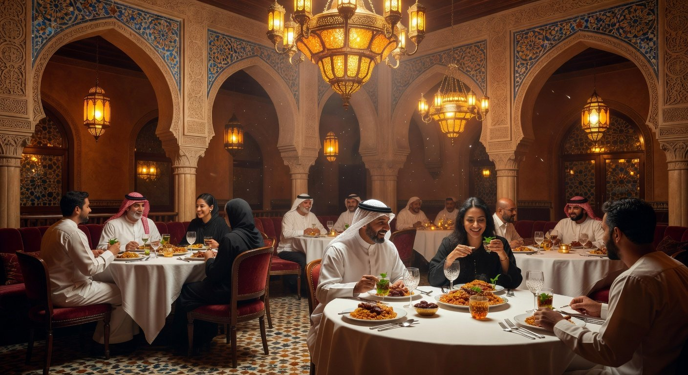

# 🍽️ مطعم الأصالة | Restaurant Landing Page

<div align="center">



# مطعم الأصالة

### تجربة عربية فاخرة بطابع عصري

<p>
Landing page احترافية لمطعم عربي بتصميم أنيق وتجربة مستخدم مميزة.
</p>

<br>


</div>

---

# ✨ Overview

تم تطوير هذه الصفحة لتكون واجهة احترافية لمطعم عربي فاخر، مع التركيز على:

- تجربة مستخدم سلسة
- تصميم متجاوب بالكامل
- إبراز الأطباق والخدمات
- زيادة الحجوزات والتفاعل
- دعم اللغة العربية RTL

---

# 🚀 Features

## ✅ واجهة احترافية
تصميم عصري مستوحى من المطاعم الفاخرة.

## ✅ Responsive Design
يعمل بسلاسة على جميع الأجهزة.

## ✅ RTL Support
دعم كامل للغة العربية.

## ✅ Smooth Animations
حركات وانتقالات ناعمة.

## ✅ WhatsApp Integration
زر مباشر للتواصل عبر واتساب.

## ✅ Food Cards
عرض احترافي للأطباق.

## ✅ Testimonials
قسم تقييمات العملاء.

## ✅ Contact Section
معلومات التواصل والحجز.

---

# 🛠️ Technologies Used

| Technology | Description |
|---|---|
| HTML5 | Structure |
| CSS3 | Styling |
| JavaScript | Interactions |
| Font Awesome | Icons |
| Google Fonts | Arabic Fonts |

---

# 📂 Folder Structure

```bash
restaurant-landing-page/
│
├── index.html
├── style.css
├── script.js
│
├── assets/
│   ├── images/
│   ├── icons/
│   └── fonts/
│
└── README.md
